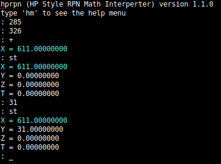

hprpn

A simple program that uses the hp style of registers to solve mathematical expressions
using reverse polish notation. This is a very minimal experiment.

To build:

$ make

To build a debug version run:

$ make debug

run hprpn in the build directory. You can type 'hm' (help menu) to see commands.
